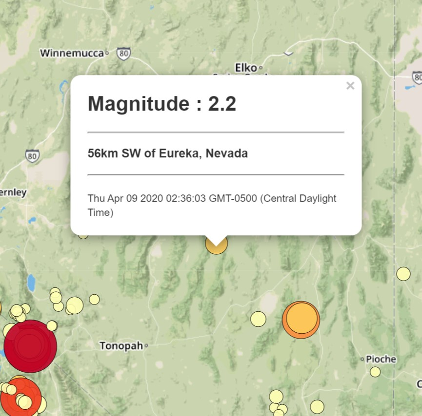
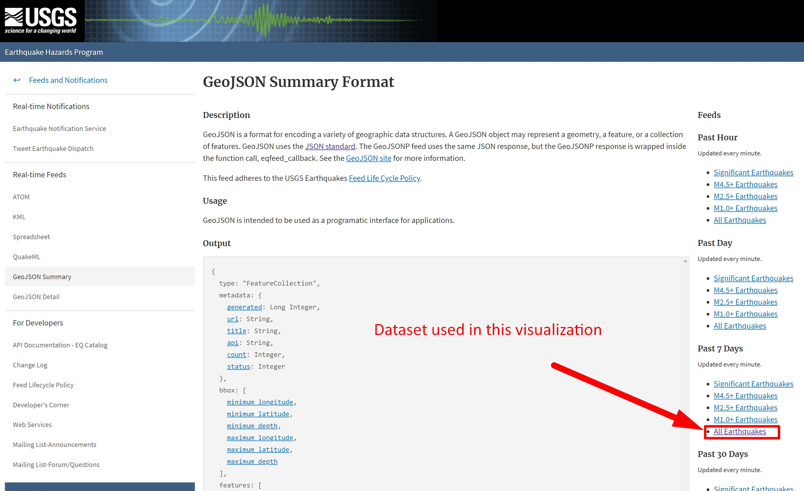
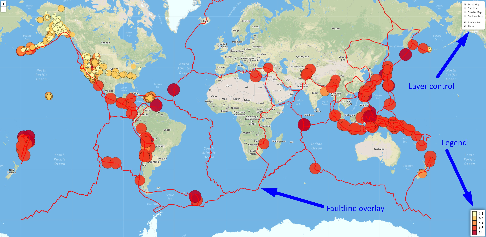

# Visualizing USGS Earthquake Data with Leaflet

## Background

Welcome to the United States Geological Survey, or USGS for short! The USGS is responsible for providing scientific data about natural hazards, the health of our ecosystems and environment; and the impacts of climate and land-use change. Their scientists develop new methods and tools to supply timely, relevant, and useful information about the Earth and its processes. As a new hire, you will be helping them out with an exciting new project!

The USGS is interested in building a new set of tools that will allow them visualize their earthquake data. They collect a massive amount of data from all over the world each day, but they lack a meaningful way of displaying it. Their hope is that being able to visualize their data will allow them to better educate the public and other government organizations (and hopefully secure more funding..) on issues facing our planet.

## Level 1: Basic Visualization of Earthquake

Level 1 Visualization plots each earthquake occurence that has occured in the prior week (obtained from the USGS last [seven days dataset](https://earthquake.usgs.gov/earthquakes/feed/v1.0/summary/all_week.geojson) ) on a standard [mapbox.streets basemap](https://www.mapbox.com/maps/streets/). Each circle is sized and colored based on the magnitude of the earthquake. A popup is associated with each point where three datapoints are displayed:
   * Magnitude of the Earthquake (used for the radius of the circle

   * Location of the earthquake

   * Date and time of the earthquake
   

## USGS Dataset
The USGS earthquake data plotted was from the [USGS GeoJSON Feed](http://earthquake.usgs.gov/earthquakes/feed/v1.0/geojson.php) page - specifically "All Earthquakes" "Last 7 days". An example of the returned JSON data is below:

   

   

### The JSON data was imported and plotted

   A map was created using Leaflet that plots all of the earthquakes from your data set based on their longitude and latitude.

   * The data markers reflect the magnitude of the earthquake in their size and color. Earthquakes with higher magnitudes should appear larger and darker in color. Note: It is possible for magnitudes to be 0 or even negative, so a function was written to convert these values to a small positive value since this parameter is used to size the radius of the circleMarkers and therefore cannot be negative.

   * Popups were coded that provided 1)Magnitude 2)Location 3)Time when clicked.

   * A legend was coded to give a scale of magnitude colors used.

- - -

### Level 2: Visualization with Basemap choice and Faultline data overlay options

A second data set and visualize it along side your original set of data. Data on tectonic plates can be found at 

A second data set with polyline data to graph the faulines of the world was obtained from <https://github.com/fraxen/tectonicplates>. The JSON returned was used to create a geoJSON object layer that can be toggled on and off. In addition, multiple basemaps from mapbox were used as well: street, satellite, dark and outdoors. Finally Layer controls were added to give the user the ability to view the overlays / basemaps of their choice.

- - -
